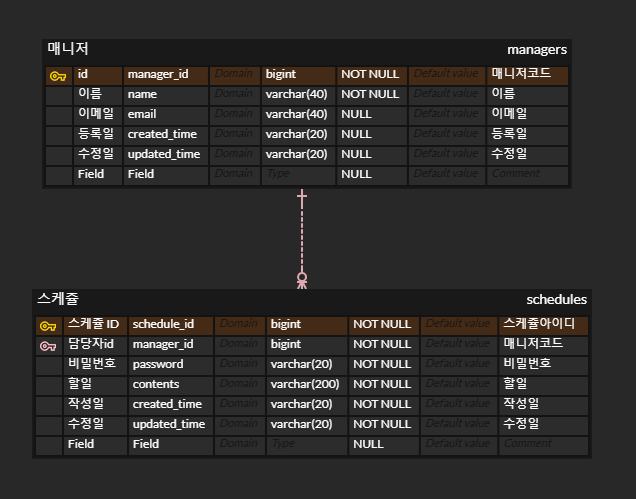

# 📚 스프링 입문 주차 개인 과제
## 소개
나만의 일정 관리 앱 서버 만들기
## API 명세서
| 기능    | Method | URL  |request| response |
|-------|--------|-|-|-|
| 일정 작성 | POST   |/api/schedules|-|-|
| 일정 수정 | PUT    |/api/schedules|-|-|
| 일정 조회 | GET    |/api/schedules/{id}|-|-|
| 일정 삭제 | DELETE |/api/schedules/{id}|-|-|

## ERD


## sql
```mysql
CREATE TABLE `schedules`
(
    `schedule_id`  bigint       NOT NULL COMMENT '스케쥴아이디',
    `manager_id`   bigint       NOT NULL COMMENT '매니저코드',
    `password`     varchar(20)  NOT NULL COMMENT '비밀번호',
    `contents`     varchar(200) NOT NULL COMMENT '할일',
    `created_time` varchar(20)  NOT NULL COMMENT '작성일',
    `updated_time` varchar(20)  NOT NULL COMMENT '수정일',
    `Field`        VARCHAR(255) NULL
);

CREATE TABLE `managers`
(
    `manager_id`   bigint       NOT NULL COMMENT '매니저코드',
    `name`         varchar(40)  NOT NULL COMMENT '이름',
    `email`        varchar(40)  NULL COMMENT '이메일',
    `created_time` varchar(20)  NULL COMMENT '등록일',
    `updated_time` varchar(20)  NULL COMMENT '수정일',
    `Field`        VARCHAR(255) NULL
);

ALTER TABLE `schedules` ADD CONSTRAINT `PK_SCHEDULES` PRIMARY KEY (`schedule_id`);

ALTER TABLE `managers` ADD CONSTRAINT `PK_MANAGERS` PRIMARY KEY (`manager_id`);

ALTER TABLE managers MODIFY manager_id bigint not null auto_increment;
ALTER TABLE schedules MODIFY schedule_id bigint not null auto_increment;

ALTER TABLE schedules add constraint schedule_fk_manager_id foreign key (manager_id) references managers (manager_id) on delete cascade
```
## 구현 리스트
-[ ] 일정 작성
-[ ] 선택한 일정 조회
-[ ] 일정 목록 조회
-[ ] 선택한 일정 수정
-[ ] 선택한 일정 삭제
- [ ] 연관 관계 설정
- [ ] 페이지네이션
- [ ] 예외 발생 처리
- [ ] `null 체크` 및 `특정 패턴`에 대한 검증 수행

<details>
<summary>구현 세부 사항</summary>

---

### 1단계 - 일정 작성
조건
1. `할일`, `담당자명`, `비밀번호`, `작성/수정일`을 저장할 수 있습니다.
    1. 기간 정보는 날짜와 시간을 모두 포함한 형태 입니다.
2. 각 일정의 고유 식별자(ID)를 자동으로 생성하여 관리합니다.
3. 최초 입력간에는 수정일은 작성일과 동일합니다.
4. 등록된 일정의 정보를 반환 받아 확인할 수 있습니다.

---

### 2단계 - 선택한 일정 조회
조건
1. 선택한 일정 단건의 정보를 조회할 수 있습니다.
2. 일정의 고유 식별자(ID)를 사용하여 조회합니다.

---

### 3단계 - 일정 목록 조회
조건
1. 다음 조건을 바탕으로 등록된 일정 목록을 전부 조회할 수 있습니다.
    1. `수정일` (형식 : YYYY-MM-DD)
    2. `담당자명`
2. 조건 중 한 가지만을 충족하거나, 둘 다 충족을 하지 않을 수도, 두 가지를 모두 충족할 수도 있습니다.
3. `수정일` 기준 내림차순으로 정렬하여 조회합니다.

---

### 4단계 - 선택한 일정 수정
조건
1. 선택한 일정 내용 중 `할일내용`, `담당자명` 만 수정 가능합니다.
    1. 서버에 일정 수정을 요청할 때 `비밀번호`를 함께 전달합니다.
    2. `작성일` 은 변경 안되며, `수정일` 은 수정 시점으로 변경합니다.
2. 수정된 일정의 정보를 반환 받아 확인할 수 있습니다.

---

### 5단계 - 선택한 일정 삭제
1. 선택한 일정을 삭제할 수 있습니다.
    1. 서버에 일정 수정을 요청할 때 `비밀번호`를 함께 전달합니다.

---

### 6단계 - 연관 관계 설정
설명
1. 동명이인의 담당자가 있어 각 담당자가 할 일을 구별할 수 없습니다!
   담당자를 식별하기 위해 이름으로만 관리하던 담당자에게 고유 식별자를 부여합니다.
2. 담당자는 일정과 분리해서 관리합니다.

조건
1. 담당자는 이름 외에 `이메일`, `등록일`, `수정일` 정보를 가지고 있습니다.
    1. 담당자의 정보는 추가로 받을 수 있습니다.
2. 고유 식별자를 통해 담당자를 조회할 수 있도록 기존 코드를 변경합니다.

---

### 7단계 - 페이지네이션
설명
1. 많은 양의 데이터를 효율적으로 표시하기 위해 데이터를 여러 페이지로 나눕니다.
    1. `페이지 번호`와 `페이지 크기`를 쿼리 파라미터로 전달하여 요청하는 항목을 나타냅니다.
    2. 전달받은 페이지 번호와 크기를 기준으로 쿼리를 작성하여 필요한 데이터만을 조회하고 반환합니다.

조건
1. 등록된 일정 목록을 `페이지 번호`와 `크기`를 기준으로 모두 조회합니다.
2. 조회한 일정 목록에는 `담당자 이름`이 포함되어 있습니다.
3. 범위를 넘어선 페이지를 요청하는 경우 빈 배열을 반환합니다.

---

### 8단계 - 예외 발생 처리
설명
1. 예외 상황에 대한 처리를 위해 [`HTTP 상태 코드(링크)`](https://developer.mozilla.org/ko/docs/Web/HTTP/Status)와 `에러 메시지`를 포함한 정보를 사용하여 예외를 관리할 수 있습니다.
    1. 필요에 따라 사용자 정의 예외 클래스를 생성하여 예외 처리를 수행할 수 있습니다.
    2. `@ExceptionHandler`를 활용하여 공통 예외 처리를 구현할 수도 있습니다.
    3. 예외가 발생할 경우 적절한 HTTP 상태 코드와 함께 사용자에게 메시지를 전달하여 상황을 관리합니다.

조건
1. 수정, 삭제 시 요청할 때 보내는 `비밀번호`가 일치하지 않을 때 예외가 발생합니다.
2. 선택한 일정 정보를 조회할 수 없을 때 예외가 발생합니다.
    1. 잘못된 정보로 조회하려고 할 때
    2. 이미 삭제된 정보를 조회하려고 할 때

---

### 9단계 - **`null 체크`** 및 **`특정 패턴`**에 대한 검증 수행
설명
1. 유효성 검사
    1. 잘못된 입력이나 요청을 미리 방지할 수 있습니다.
    2. 데이터의 `무결성을 보장`하고 애플리케이션의 예측 가능성을 높여줍니다.
    3. Spring에서 제공하는 `@Valid` 어노테이션을 이용할 수 있습니다.

조건
1. `할일 제목`은 최대 200자 이내로 제한, 필수값 처리
2. `비밀번호`는 필수값 처리
3. 담당자의 `이메일` 정보가 형식에 맞는지 확인
</details>